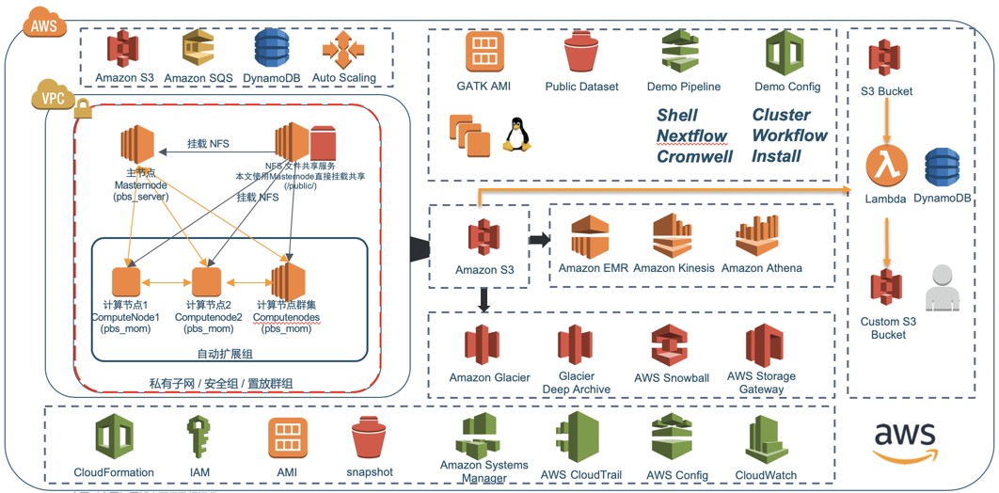

# GATK Best Practice on AWS

* [Summary](#Summary)
* [Features](#Features)
* [Solutions](#Solutions)
    * [Cluster Solution](#Cluster-Solution)
    * [End-to-end Solution](#End-to-end-Solution)
* [Migration Guide](#Migration-Guide)
* [Quick Start](#Quick-Start)
    * [Cluster](#10-Minutes-Cluster-Building)
      * [Install awscli & pip](#Install-awscli-&-pip)
      * [Install pcluster](#Install-pcluster)
      * [Config pcluster](#Config-pcluster)
      * [Launch Cluster](#Launch-Cluster)
      * [SSH to Master Node](#SSH-to-Master-Node)
      * [Submit Task](#Submit-Task)
    * [AMI](#ami)
    * [DEMO](#demo)
* [Reference：](#Reference)
* [FAQ](#faq)


## Summary

The analysis platform of the current genetic industry can roughly divided into three categories: Single node, server based cluster(classic HPC cluster), and docker based cluster(Kubernetes cluster). Most of the analysis applications are still built on the classic on-premise HPC cluster and many of them are on-premise. 

But on-premise HPC may encounter the following challenges:

+ There will need **several months** to build **one cluster**. It's too long to keep up with business.
+ It's hard to **operate** and achieve **high availability** for the cluster.
+ It's hard to take **data life-cycle management**.
+ It's are difficult to **control resources accurately**.
+ ...

In addition to this, there are many challenges that will bother you. In order to help overcome and solve these challenges, we have designed a turn key solution that can create a complete HPC cluster with one click. It is also possible to enable local users to build in the life sciences by replicating the template and minimizing the cost of local testing, migration, and clustering on the cloud. A safe, reliable, efficient, and low-cost HPC clusters can liberate the developer and operator from trivial matters and let them focus on more creative things.

The core service of this solution is [AWS ParallelCluster](https://aws.amazon.com/blogs/opensource/aws-parallelcluster/), which comes with jobwatcher and can monitor the SGE, Slurm or Torque operation every minute to determine when the node need elastically stretched. It can directly bring about 30% cost savings.

More About AWS ParallelCluster, you can reference ***[AWS ParallelCluster user guide](https://docs.aws.amazon.com/parallelcluster/latest/ug/processes.html).***


***

## Features

Which situation can we solve：
+ Production and testing environment in **one** cluster.
+ NO DR.


+ It is difficult to calculate the resources.


+ Cluster operation need many operator, and no version control. 


+ Other challenges of industry:
  + Project management relies on manual tracking, no information system or low degree of informationization
  + It's hard to calculate the cost in the whole pipeline.
  + Data is very huge and complex. It's difficult to achieve life-cycle management

***

## Solutions
### Cluster Solution

### End-to-end Solution

## Migration Guide
[Migration Guide](doc/01.migrate/README.md)
## Quick Start
### Cluster
下述文档示例会启动一个完整的HPC集群，包括主节点、计算节点、共享存储以及预装SGE作业调度系统，AMI为预装GATK相关软件的镜像，包括bwa，Samtools，gatk4等，镜像snapshot为GATK公开数据集，包括数据库及测试文件，启动后挂载到/genomics目录下。

***[注：测试以宁夏区为例，本测试需要账号有多个资源的创建权限(初期测试可用admin access)](https://docs.aws.amazon.com/zh_cn/parallelcluster/latest/ug/iam.html)***

#### Install awscli & pip

+ [Install awscli](https://docs.aws.amazon.com/zh_cn/cli/latest/userguide/cli-chap-install.html)
+ aws_access_key_id及aws_secret_access_key


**请登录console，并点击*我的安全凭证***

**Create and save aws_access_key_id及aws_secret_access_key**

<br>


<br>


<br>
<br>

```shell
#Install pip
curl https://bootstrap.pypa.io/get-pip.py -o get-pip.py
python get-pip.py

#Install awscli
sudo pip install awscli

#Config awscli
#set AK, SK, region and outpu type
aws configure 
```
#### Install pcluster
```shell
sudo pip install aws-parallelcluster
```

#### Config pcluster
##### ①、相关准备

+ VPC及子网

**请搜索VPC服务，并选择你要Launch Cluster的VPC**

**记录vpc_id，master_subnet_id**

<br>


<br>


<br>


<br>
<br>

+ EC2访问密钥

**搜索EC2服务，并进入EC2服务页面选择密钥对，创建新密钥并下载密钥文件**

**记录key_name为创建密钥对输入的名字**

<br>


##### ②、配置pcluster config([可参考官方博客](https://docs.aws.amazon.com/zh_cn/parallelcluster/latest/ug/configuration.html))

```shell
#创建配置模版,会提示无配置，请忽略错误信息
pcluster create new

#编辑配置文档
vim ~/.parallelcluster/config

#复制下述配置信息，粘贴到配置文档~/.parallelcluster/config
[aws]
aws_region_name = cn-northwest-1

[global]
update_check = true
sanity_check = true
cluster_template = GATK-pipeline

[aliases]
ssh = ssh {CFN_USER}@{MASTER_IP} {ARGS}

[cluster GATK-pipeline]
base_os = alinux
custom_ami = ami-005db8a58ebd4e9a4 #根据需要修改
vpc_settings = public
scheduler = slurm
key_name = ZHY_key  #需要修改
compute_instance_type = m5.xlarge
master_instance_type = m5.xlarge
compute_root_volume_size = 50
master_root_volume_size = 50
ebs_settings = genomes
scaling_settings = GATK-ASG
initial_queue_size = 1
max_queue_size = 4
maintain_initial_size = false
extra_json = { "cluster" : { "cfn_scheduler_slots" : "cores" } }

[vpc public]
vpc_id = vpc-a817aac5  #需要修改
master_subnet_id = subnet-26fcc86cd  #需要修改

[ebs genomes]
shared_dir = genomes
ebs_snapshot_id = snap-040c71fd2bb5d4236 #根据需要修改
volume_type = gp2
volume_size =  1024

[scaling GATK-ASG]
scaledown_idletime = 5
```
    
#### Launch Cluster
```shell
pcluster create GATK-pipeline
```
    
#### SSH to Master Node
```shell
#根据集群启动后的反馈信息输入
#ssh -i <private key_name> <username>@<public ip>
ssh -i <private key_name> ec2-user@master-public-ip #alinux
ssh -i <private key_name> ubuntu@master-public-ip #ubuntu
ssh -i <private key_name> centos@master-public-ip #centos
```
    
#### Submit Task
默认预装SGE作业调度系统，示例sge调度系统投递命令参考如下：
```
echo "sleep 180" | qsub
echo "sh run.sh" | qsub -l vf=2G,s_core=1 -q all.q
for((i=1;i<=10;i++));do echo "sh /genomes/temp/run.sh $i" | qsub -cwd -S /bin/bash -l vf=2G,s_core=1 -q all.q;done
```    

示例slurm调度系统投递命令参考如下：
```shell
sbatch -n 4 run.sh  #4核，可根据需要修改
squeue #查看队列情况
sinfo #查看节点情况
scancel jobid #取消任务
```

示例pbs调度系统投递命令参考如下：
```shell
echo "sleep 180" | qsub
echo "sh run.sh" | qsub -l nodes=1,walltime=2:00:00,mem=2gb -q batch
for((i=1;i<=10;i++));do echo "sh /genomes/temp/run.sh $i" | qsub -l nodes=1,walltime=2:00:00,mem=2gb -q batch;done
```

### AMI
***制作自定义ami请参考官方文档***

+ [alinux](https://github.com/lab798/GATK-Best-Practice-on-AWS/tree/master/AMI/alinux.sh)
+ [ubuntu](https://github.com/lab798/GATK-Best-Practice-on-AWS/tree/master/AMI/ubuntu.sh)

### DEMO

+ [基于nextflow工具调度的demo](https://github.com/lab798/GATK-Best-Practice-on-AWS/tree/master/example/nextflow/README.md)
+ [基于cromwell工具调度的demo](https://github.com/lab798/GATK-Best-Practice-on-AWS/tree/master/example/cromwell/README.md)
+ [基于shell的demo](https://github.com/lab798/GATK-Best-Practice-on-AWS/tree/master/example/shell/README.md)


## Reference：

+ [Parallelcluster官方博客.](https://amazonaws-china.com/cn/blogs/china/aws-parallelcluster/)
+ [parallelcluster文档.](https://docs.aws.amazon.com/zh_cn/parallelcluster/latest/ug/what-is-aws-parallelcluster.html)
+ [aws-parallelcluster GitHub 存储库.](https://github.com/aws/aws-parallelcluster)
+ 镜像版本迭代

|系统	|版本号	|pcluster版本	|AMI ID	|更新描述	|地域	|是否公开	|可用性	|备注	|
|---	|---	|---	|---	|---	|---	|---	|---	|---	|
|alinux-base	|	|2.3.1	|ami-0e58e06d5b958ccb6	|基础镜像	|BJS	|是	|是	|	|
|ubuntu-base	|16.04	|2.3.1	|ami-0a9c1879e6583621e	|基础镜像	|BJS	|是	|是	|	|
|alinux	|0.1	|2.3.1	|ami-0997595bce93c6e7b	|基础软件环境AMI	|BJS	|是	|是	|	|
|alinux	|0.2	|2.3.1	|ami-0cad4e9d804bd9c15	|基础软件环境AMI + Golang环境 + goofys；修复pip问题并安装awscli；修复goofys无法挂载问题，安装fuse依赖	|BJS	|是	|是	|	|
|alinux	|0.2	|2.4.0	|ami-0b876120ec98b9a7c	|基础软件环境AMI	|BJS	|是	|是	|	|
|ubuntu	|0.1	|2.3.1	|ami-097d3bf901991372e	|基础软件环境AMI	|BJS	|是	|是	|	|
|ubuntu	|0.2	|2.3.1	|ami-041e4a3bce09385b9	|修改ubuntu默认shell(dash)为bash	|BJS	|是	|是	|不再更新	|
|ubuntu	|0.2-a	|2.3.1	|ami-026882b56146cdc1b	|基础软件环境AMI + Golang环境 + goofys	|BJS	|是	|是	|	|
|alinux	|0.1	|2.3.1	|ami-007f6ed61542ae017	|基础软件环境AMI	|ZHY	|是	|是	|	|
|alinux	|0.2	|2.4.0	|ami-005db8a58ebd4e9a4	|基础软件环境AMI	|ZHY	|是	|是	|	|
|ubuntu	|0.1	|2.3.1	|ami-0a1d99c2c70e3f86c	|基础软件环境AMI	|ZHY	|是	|否	|	|
|ubuntu	|0.2	|2.3.1	|ami-071aa7a2927cc02a8	|修改ubuntu默认shell(dash)为bash	|ZHY	|是	|否	|不再更新	|
|ubuntu	|0.2-a	|2.3.1	|ami-015f3a018cc98b6cc	|基础软件环境AMI + Golang环境 + goofys	|ZHY	|是	|否	|	|

•   参考文件EBS快照迭代：

|名称	|版本号	|snap ID	|大小	|更新描述	|地域	|
|---	|---	|---	|---	|---	|---	|
|gatk-reference v0.1	|0.1	|snap-09c16ac9809cf4359	|100G	|基础环境快照，包含hg19参考基因组	|BJS	|
|gatk-reference v0.2	|0.2	|snap-06f5e874571e44510	|100G	|增加hg38及GATK数据集	|BJS	|
|gatk-reference-v0.3	|0.3	|snap-08a4b975a2f40736f	|1T	|增加测试文件及GATK-TEST-DATA	|BJS	|
|gatk-reference-v0.3	|0.3	|snap-040c71fd2bb5d4236	|1T	|增加测试文件及GATK-TEST-DATA	|ZHY	|
|	|	|	|	|	|	|

## FAQ

